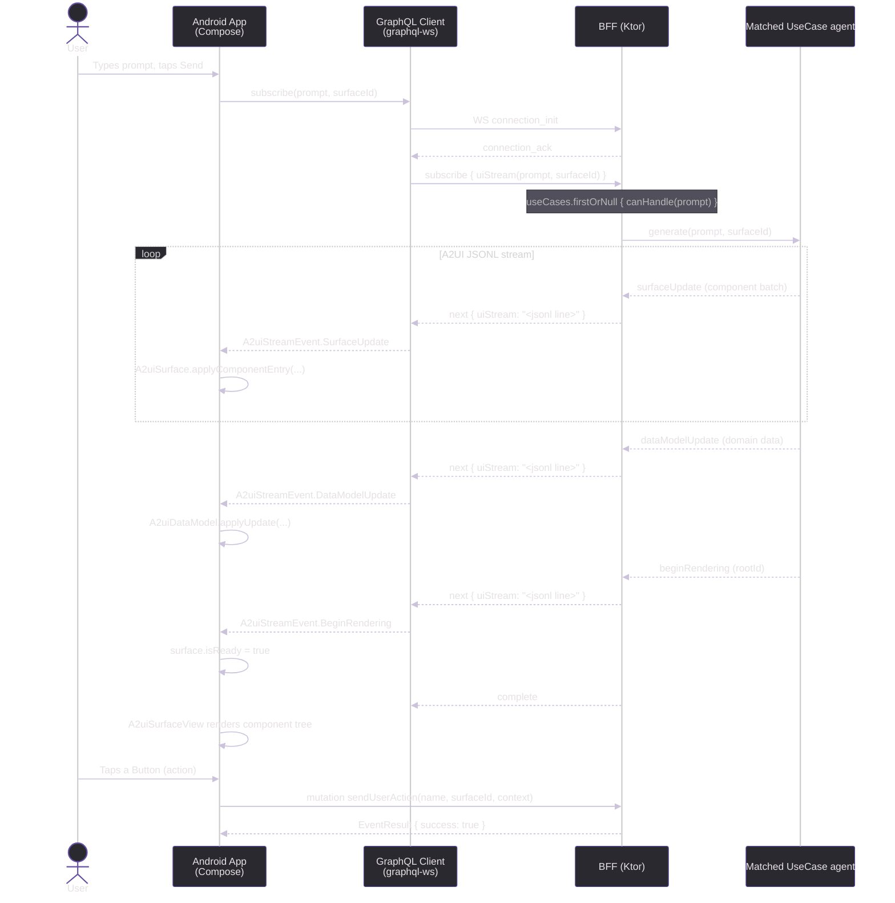

# A2UI Exploration

## Motivation

Most mobile UI frameworks follow the same model: a designer creates screens, an engineer implements them in platform-specific code, the feature ships in a release, and the cycle repeats. That model works well at small scale but creates meaningful friction as products grow:

- **Release lag.** A layout change, copy update, or new feature requires a code change, a review, a release, and (on iOS) App Store review before it reaches users.
- **Platform duplication.** The same screen is built twice — once in Swift/UIKit or SwiftUI, once in Kotlin/Compose — with subtle divergence over time.
- **Tight coupling between agent logic and client code.** When an AI agent wants to present information in a new way, the client must already know how to render it.

**A2UI** inverts this by treating the UI as a data format. The server streams a component graph to the client; the client renders whatever it receives using a fixed, general-purpose widget vocabulary. Adding a new feature or changing a layout is a server-side change only — no app update needed, no platform duplication, and the agent fully controls what the user sees.

This repository is an exploration of that premise: a minimal Ktor BFF emitting A2UI streams and a Jetpack Compose client that renders them generically, using a mock banking domain to demonstrate realistic use cases.

---

## Architecture Overview

```
┌─────────────────────────┐        GraphQL / WS         ┌─────────────────────────┐
│   Android (Compose)     │ ◄─────────────────────────► │   BFF (Ktor / JVM)      │
│  com.dgurnick.android   │                             │  com.dgurnick.bff       │
│                         │  Subscription: uiStream     │                         │
│  A2uiGraphQlClient      │  Mutation:     sendAction   │  A2uiSchema (gql-k)     │
│  A2uiSurfaceManager     │  Query:        agentCard    │  UseCase (interface)    │
│  A2uiRenderer (Compose) │                             │  Banking agents (4)     │
└─────────────────────────┘                             └─────────────────────────┘
```

---

## Sequence Diagram



---

## Tech Stack

| Layer    | Technology |
|----------|-----------|
| Android  | Kotlin 1.9.24 · Jetpack Compose (BOM 2024.06.00) · Material3 · OkHttp 4.12 · kotlinx-serialization |
| BFF      | Kotlin/JVM · Ktor 2.3.11 · graphql-kotlin-ktor-server 7.1.4 · Jackson 2.17.2 · WebSockets |
| Protocol | A2UI v0.8 — JSONL streaming over GraphQL WebSocket subscription |
| Build    | Gradle 8 (Kotlin DSL) · AGP 8.4.2 |

---

## Project Structure

```
a2ui/
├── android/                         # Android app (Jetpack Compose)
│   ├── app/src/main/kotlin/com/dgurnick/android/
│   │   ├── a2ui/
│   │   │   ├── A2uiMessages.kt      # A2UI v0.8 wire-format models
│   │   │   ├── A2uiDataModel.kt     # JSON-pointer data store + BoundValue resolver
│   │   │   ├── A2uiGraphQlClient.kt # graphql-ws subscription + HTTP mutations
│   │   │   └── A2uiRenderer.kt      # Compose widget registry + A2uiSurfaceView
│   │   └── ui/
│   │       ├── A2uiViewModel.kt     # StateFlow state, surface lifecycle
│   │       ├── A2uiApp.kt           # Root Compose screen
│   │       ├── MainActivity.kt      # ComponentActivity entry point
│   │       └── theme/               # Material3 theme (Color, Type, Theme)
│   └── gradle/libs.versions.toml
│
├── bff/                             # Backend-for-Frontend (Ktor)
│   ├── src/main/kotlin/com/dgurnick/bff/
│   │   ├── Application.kt           # Ktor app entry, GraphQL plugin
│   │   ├── graphql/A2uiSchema.kt    # Query / Mutation / Subscription schema
│   │   ├── usecase/UseCase.kt       # UseCase interface (canHandle + generate)
│   │   ├── agent/AtmFinderAgent.kt  # "Where is the nearest ATM?"  → Map widget
│   │   ├── agent/AccountBalanceAgent.kt    # "What is my account balance?"
│   │   ├── agent/BankOffersAgent.kt        # "What offers do you have for me?"
│   │   ├── agent/FallbackAgent.kt  # Catch-all — shows suggestions chips
│   │   ├── model/A2uiMessages.kt    # BFF-side A2UI models
│   │   ├── model/ComponentBuilders.kt      # Component DSL helpers (incl. Map)
│   │   └── routes/A2uiRoutes.kt     # Ktor routing (POST, SDL, GraphiQL, WS)
│   └── bruno/                       # Bruno API test collection
│
└── README.md
```

---

## GraphQL API

### Query
```graphql
query {
  agentCard {
    id
    name
    description
    version
    capabilities
  }
}
```

### Subscription — A2UI stream
```graphql
subscription {
  uiStream(prompt: "Where is the nearest ATM?", surfaceId: "main")
}
```

Example prompts handled by the banking agents:

| Prompt | Agent |
|--------|-------|
| "Where is the nearest ATM?" / "closest cash machine" | `AtmFinderAgent` — renders a Map + list |
| "What is my account balance?" / "show transactions" | `AccountBalanceAgent` — cards per account |
| "What offers do you have?" / "any loan deals?" | `BankOffersAgent` — personalised offer cards |
| _(anything else)_ | `FallbackAgent` — "I didn't understand" + suggestion chips |
Each `next` message carries a single JSONL line — one of:
- `{"surfaceUpdate": { "surfaceId": "...", "components": [...] }}`
- `{"dataModelUpdate": { "surfaceId": "...", "path": "/", "contents": [...] }}`
- `{"beginRendering": { "surfaceId": "...", "root": "<componentId>" }}`
- `{"deleteSurface": { "surfaceId": "..." }}`

### Mutations
```graphql
mutation {
  sendUserAction(input: { name: "search", surfaceId: "main", sourceComponentId: "searchBtn", timestamp: "...", context: "{}" }) {
    success
  }
}

mutation {
  reportError(input: { message: "render failed", componentId: "card-1" }) {
    success
  }
}
```

---

## Running Locally

### BFF
```bash
cd bff
./gradlew run
# GraphQL endpoint: http://localhost:8080/graphql
# GraphiQL UI:      http://localhost:8080/graphiql
# SDL:              http://localhost:8080/sdl
# WS subscriptions: ws://localhost:8080/subscriptions
```

### Android
1. Start the BFF (above).
2. Open `android/` in Android Studio.
3. Run on an emulator — the app connects to `http://10.0.2.2:8080` (emulator localhost alias).

---

## A2UI Protocol — Message Flow

| Step | Direction | Message | Purpose |
|------|-----------|---------|---------|
| 1 | Server → Client | `surfaceUpdate` (×N) | Stream component graph batches |
| 2 | Server → Client | `dataModelUpdate` | Populate bound data |
| 3 | Server → Client | `beginRendering` | Signal root + render start |
| 4 | Client → Server | `sendUserAction` | User interaction events |
| 5 | Server → Client | `deleteSurface` | Tear down a surface |

Components reference children by ID (adjacency list). `BoundValue` fields resolve at render time against the `A2uiDataModel` using JSON Pointer paths.

---

## Bruno Tests

API tests live in `bff/bruno/`. Import the collection in [Bruno](https://www.usebruno.com/) and select the **local** environment.

---

## iOS Client — What Would Be Required

The A2UI protocol is transport- and platform-agnostic. An iOS client would need exactly the same three building blocks as the Android one, implemented with native Apple tooling:

### 1. GraphQL WebSocket client
The `graphql-ws` subprotocol must be spoken over a WebSocket. On iOS this is typically done with [Apollo iOS](https://www.apollographql.com/docs/ios/) (which has built-in `graphql-ws` support) or a lightweight custom implementation using `URLSessionWebSocketTask`. The subscription, mutation, and query shapes are identical to the Android client.

### 2. Component renderer
A Swift / SwiftUI equivalent of `A2uiRenderer.kt`:
- A `WidgetRegistry` dictionary mapping type-name strings to `@ViewBuilder` closures
- A recursive `A2uiSurfaceView` that looks up each component by ID, resolves its type, and calls the matching builder
- The same `BoundValue` / JSON-pointer data model resolution logic, implemented in Swift with `Codable`

The built-in widget set (Column → `VStack`, Row → `HStack`, Text → `Text`, Button → `Button`, Card → `GroupBox`, List → `LazyVStack` inside `ScrollView`) maps naturally to SwiftUI primitives with no third-party dependencies.

### 3. Map widget
OSMDroid is Android-only. The iOS equivalent is:
- **MapKit + SwiftUI** (`Map` view, `Annotation`) — zero dependencies, no API key, ships with every iOS device. This is the direct equivalent of the OSMDroid choice made here.
- OpenStreetMap tiles can be used via `MKTileOverlay` pointed at the OSM tile CDN if higher-detail tiles are needed.

### Shared protocol artefacts
The A2UI JSON wire format and all `UseCase` agents live entirely in the BFF and require no changes. The BFF is already platform-agnostic by design — the iOS client would subscribe to the same `uiStream` endpoint and receive the same JSONL stream.

---

## Design Decisions — Pros & Cons

### A2UI: Server-driven UI over a streaming protocol

| | |
|---|---|
| **Pro** | All feature logic lives on the server. The client ships once and renders any future feature without an app-store update. |
| **Pro** | A/B testing, personalisation, and content changes are instant — no release cycle required. |
| **Pro** | The component graph is declarative and inspectable as plain JSON, making it easy to audit and test independently of both client and server. |
| **Con** | Every interaction round-trips to the server. Offline or high-latency scenarios degrade significantly without an explicit caching layer. |
| **Con** | Debugging spans two codebases simultaneously — a rendering bug requires checking both the JSONL emitted by the BFF and the Compose widget tree. |
| **Con** | The client's widget vocabulary is a hard constraint. Any widget the server references that the client doesn't know how to render is silently skipped, making schema drift a silent failure mode. |

---

### GraphQL WebSocket subscriptions (graphql-ws) for streaming

| | |
|---|---|
| **Pro** | Subscriptions give a well-understood, typed contract between client and server. The schema documents what can flow over the wire. |
| **Pro** | GraphiQL works out of the box for manual exploration and debugging without writing a dedicated test client. |
| **Pro** | graphql-kotlin generates the schema from annotated Kotlin classes, eliminating the need to maintain a separate SDL file. |
| **Con** | GraphQL subscriptions carry meaningful overhead per message (framing, type envelope). For a high-frequency stream of small JSONL lines, a plain WebSocket or SSE would be lighter. |
| **Con** | The `next` payload is a stringly-typed `String` (the JSONL line). GraphQL's type system offers no benefit here — the inner structure is opaque to the schema. |
| **Con** | graphql-kotlin's annotation-driven approach makes it harder to compose schemas from independent modules compared with SDL-first approaches. |

---

### Ktor as the BFF runtime

| | |
|---|---|
| **Pro** | Minimal footprint — no reflection-heavy DI container, starts in under a second. Straightforward to package as a shadow JAR. |
| **Pro** | Coroutine-native: `Flow`-based streaming aligns naturally with Kotlin coroutines and the subscription model. |
| **Con** | Ktor's plugin ecosystem is thinner than Spring Boot's. Features like structured logging, metrics, and distributed tracing require more manual wiring. |
| **Con** | Error handling across the WebSocket lifecycle (connection drops, back-pressure, subscription cancellation) requires explicit care; there is no framework-level retry or circuit-breaker support built in. |

---

### UseCase interface with `canHandle` keyword matching

| | |
|---|---|
| **Pro** | Trivially simple to add a new use case — implement two methods, add to the ordered list in `Application.kt`. No framework or annotation required. |
| **Pro** | The ordered-list dispatch makes priority explicit and inspectable in one place. |
| **Con** | Keyword matching on raw prompt strings is brittle. Synonyms, typos, or multi-intent prompts will fall through to the `FallbackAgent`. In production this layer should be replaced by an intent-classification model or an LLM routing step. |
| **Con** | There is no context window — each subscription call is stateless. Multi-turn conversations (e.g. "show my savings account" after already viewing balances) are not supported without adding session state. |

---

### Jetpack Compose + custom `WidgetRegistry` renderer

| | |
|---|---|
| **Pro** | Adding a new widget type (e.g. `MapWidget`) requires only one entry in the registry and no changes elsewhere in the app. The renderer is genuinely open for extension. |
| **Pro** | Compose's declarative model pairs well with the server-driven component graph — re-composing a subtree when a `surfaceUpdate` arrives is natural. |
| **Con** | The `WidgetRegistry` is a global `Map<String, @Composable>`. It is not scoped, versioned, or validated against the server's catalog, so a server sending an unknown widget type silently renders nothing. |
| **Con** | Canvas-based widgets (e.g. `MapWidget`) bypass Compose's layout system. Sizing, accessibility, and dark-mode support must be handled entirely by hand. |
| **Con** | `kotlinx-serialization` and `BoundValue` polymorphism require `@SerialName` discipline across every model class. A mismatch between BFF field names and Android model field names produces silent null/default values rather than a compile-time error. |
