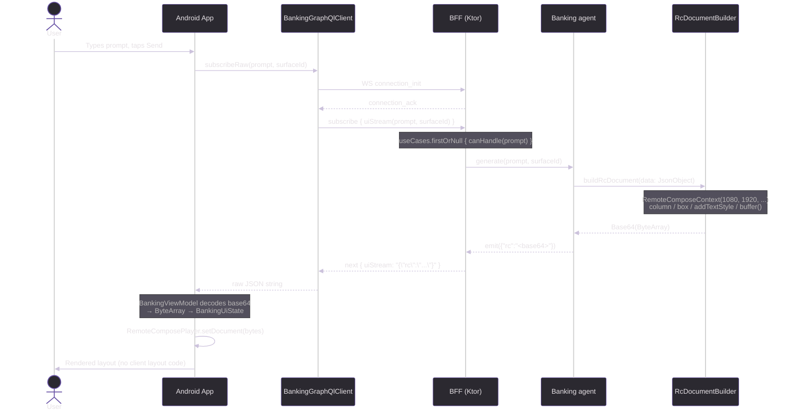

# Banking Demo — Remote Compose Exploration

This repository explores two different approaches to **server-driven UI** for a mock banking app: a classic [A2UI](https://a2ui.org) JSONL stream and (on the `feature/remote-compose` branch) **Jetpack Remote Compose**, where the server produces a binary layout document that the Android client renders without any UI logic of its own.

---

## Branches

| Branch | Approach | Server emits | Client does |
|--------|----------|--------------|-------------|
| `master` | A2UI v0.8 | JSONL component graph | Interprets component tree → Compose widgets |
| `feature/remote-compose` | Remote Compose | Binary RC document (base64) | `RemoteComposePlayer.setDocument(bytes)` |

---

## A2UI vs Remote Compose

### A2UI
```
BFF ──{ JSONL component graph }──► Android
                                   A2uiRenderer interprets tree
                                   emits Compose widgets at runtime
```
The server streams a *description* of the UI. The client must know how to interpret every component type — it owns the rendering logic.

### Remote Compose (this branch)
```
BFF ──{ RC binary document }──► Android
   RemoteComposeContext             RemoteComposePlayer.setDocument(bytes)
   builds layout on the JVM         plays it — no layout logic on device
```
The server builds the *actual layout* using `RemoteComposeContext` (a pure JVM API from `androidx.compose.remote:remote-creation-core`). It serialises the result to a binary byte array, base64-encodes it, and sends it over the GraphQL subscription. The Android client only decodes the bytes and hands them to `RemoteComposePlayer`. No layout code lives on the device.

**Key difference:** with Remote Compose, changing what the user sees — layout, typography, colours, content — is a server-side change only. The app needs no update.

---

## Architecture (Remote Compose branch)

```
┌──────────────────────────────┐     GraphQL / WebSocket      ┌────────────────────────────────┐
│   Android (Compose)          │ ◄──────────────────────────► │   BFF (Ktor / JVM)             │
│  com.dgurnick.banking        │                              │  com.dgurnick.banking.bff      │
│                              │  Subscription: uiStream      │                                │
│  BankingGraphQlClient        │  Mutation:     sendAction    │  BankingSchema (graphql-kotlin)│
│  BankingViewModel            │  Query:        agentCard     │  UseCase (interface)           │
│  RcDocumentView              │                              │  Banking agents (4)            │
│  RemoteComposePlayer         │  {"rc":"<base64 bytes>"}     │  RcDocumentBuilder             │
└──────────────────────────────┘                              └────────────────────────────────┘
```

---

## Sequence Diagram



---

## Tech Stack

| Layer   | Technology |
|---------|-----------|
| Android | Kotlin · Jetpack Compose (BOM 2024.06.00) · Material3 · OkHttp 4.12 · kotlinx-serialization · `remote-core` · `remote-player-core` · `remote-player-view` |
| BFF     | Kotlin 2.1.20 · Ktor 2.3.11 · graphql-kotlin-ktor-server 7.1.4 · `remote-creation-core:1.0.0-alpha06` · `remote-core:1.0.0-alpha06` |
| Protocol | GraphQL subscription (graphql-transport-ws) · `{"rc":"<base64 RC binary>"}` |
| Build   | Gradle 8 (Kotlin DSL) · AGP 8.4.2 |

---

## Project Structure

```
banking-demo/
├── android/                              # Android app (Jetpack Compose)
│   └── app/src/main/kotlin/com/dgurnick/banking/
│       ├── client/
│       │   ├── BankingGraphQlClient.kt   # graphql-ws subscription + HTTP mutations
│       │   ├── BankingMessages.kt        # wire-format models (legacy A2UI types)
│       │   └── RcDocumentView.kt         # AndroidView wrapping RemoteComposePlayer
│       └── ui/
│           ├── BankingViewModel.kt       # StateFlow state; base64-decodes RC bytes from BFF
│           ├── BankingApp.kt             # Root Compose screen (prompt bar + RC player)
│           ├── MainActivity.kt           # ComponentActivity entry point
│           └── theme/                    # Material3 theme (Color, BankingTheme, Type)
│
├── bff/                                  # Backend-for-Frontend (Ktor)
│   └── src/main/kotlin/com/dgurnick/banking/bff/
│       ├── Application.kt                # Ktor app entry, GraphQL plugin
│       ├── graphql/BankingSchema.kt      # Query / Mutation / Subscription schema
│       ├── usecase/UseCase.kt            # UseCase interface (canHandle + generate)
│       ├── agent/RcDocumentBuilder.kt    # ★ SERVER-SIDE RC creation (RemoteComposeContext)
│       ├── agent/AccountBalanceAgent.kt  # "What is my account balance?"
│       ├── agent/AtmFinderAgent.kt       # "Where is the nearest ATM?"
│       ├── agent/BankOffersAgent.kt      # "What offers do you have for me?"
│       ├── agent/FallbackAgent.kt        # Catch-all
│       ├── model/BankingMessages.kt      # BFF-side models
│       ├── model/ComponentBuilders.kt    # Component DSL helpers
│       └── routes/BankingRoutes.kt       # Ktor routing (POST, SDL, GraphiQL, WS)
│
└── README.md
```

---

## GraphQL API

### Subscription — RC document stream
```graphql
subscription {
  uiStream(prompt: "What is my account balance?", surfaceId: "main")
}
```

Each `next` payload contains a single JSON object:
```json
{ "rc": "<base64-encoded Remote Compose binary document>" }
```

Example prompts:

| Prompt | Agent |
|--------|-------|
| "Where is the nearest ATM?" / "closest cash machine" | `AtmFinderAgent` |
| "What is my account balance?" / "show transactions" | `AccountBalanceAgent` |
| "What offers do you have?" / "any loan deals?" | `BankOffersAgent` |
| _(anything else)_ | `FallbackAgent` |

### Query
```graphql
query {
  agentCard {
    name
    description
    version
    supportedCatalogIds
    acceptsInlineCatalogs
  }
}
```

### Mutations
```graphql
mutation {
  sendUserAction(input: { name: "search", surfaceId: "main",
    sourceComponentId: "searchBtn", timestamp: "...", context: "{}" }) {
    status
  }
}

mutation {
  reportError(input: { message: "render failed", componentId: "card-1" }) {
    status
  }
}
```

---

## Running Locally

### BFF
```bash
cd bff
./gradlew run
# GraphQL endpoint: http://localhost:8080/graphql
# GraphiQL UI:      http://localhost:8080/graphiql
# SDL:              http://localhost:8080/sdl
# WS subscriptions: ws://localhost:8080/subscriptions
```

### Android
1. Start the BFF (above).
2. Open `android/` in Android Studio.
3. Run on an emulator — the app connects to `http://10.0.2.2:8080` (emulator → host alias).

---

## Key Implementation Detail — `RcDocumentBuilder.kt`

All layout creation is in [`bff/…/agent/RcDocumentBuilder.kt`](bff/src/main/kotlin/com/dgurnick/banking/bff/agent/RcDocumentBuilder.kt). It uses the pure-JVM `RemoteComposeContext` API:

```kotlin
fun buildRcDocument(data: JsonObject): String {
    val ctx = RemoteComposeContext(1080, 1920, type, RcPlatformServices.None)
    ctx.column(RecordingModifier().fillMaxSize().padding(24f), 0, 0) {
        // lambda-with-receiver: this = RemoteComposeContext
        val titleStyle = addTextStyle(null, null, 22f, ...)
        box(RecordingModifier().fillMaxWidth(), 0, 0) {
            drawTextAnchored("Good morning, Alex", 0f, 0f, 1080f, 56f, titleStyle)
        }
    }
    return Base64.getEncoder().encodeToString(ctx.buffer())
}
```

The Android client receives the base64 string and renders it with no layout logic:

```kotlin
val bytes = Base64.decode(rcBase64, Base64.DEFAULT)
RemoteComposePlayer(context).setDocument(bytes)
```

---

## A2UI Protocol — Message Flow

| Step | Direction | Message | Purpose |
|------|-----------|---------|---------|
| 1 | Server → Client | `surfaceUpdate` (×N) | Stream component graph batches |
| 2 | Server → Client | `dataModelUpdate` | Populate bound data |
| 3 | Server → Client | `beginRendering` | Signal root + render start |
| 4 | Client → Server | `sendUserAction` | User interaction events |
| 5 | Server → Client | `deleteSurface` | Tear down a surface |

Components reference children by ID (adjacency list). `BoundValue` fields resolve at render time against the `A2uiDataModel` using JSON Pointer paths.

---

## Bruno Tests

API tests live in `bff/bruno/`. Import the collection in [Bruno](https://www.usebruno.com/) and select the **local** environment.

---

## iOS Client — What Would Be Required

The A2UI protocol is transport- and platform-agnostic. An iOS client would need exactly the same three building blocks as the Android one, implemented with native Apple tooling:

### 1. GraphQL WebSocket client
The `graphql-ws` subprotocol must be spoken over a WebSocket. On iOS this is typically done with [Apollo iOS](https://www.apollographql.com/docs/ios/) (which has built-in `graphql-ws` support) or a lightweight custom implementation using `URLSessionWebSocketTask`. The subscription, mutation, and query shapes are identical to the Android client.

### 2. Component renderer
A Swift / SwiftUI equivalent of `A2uiRenderer.kt`:
- A `WidgetRegistry` dictionary mapping type-name strings to `@ViewBuilder` closures
- A recursive `A2uiSurfaceView` that looks up each component by ID, resolves its type, and calls the matching builder
- The same `BoundValue` / JSON-pointer data model resolution logic, implemented in Swift with `Codable`

The built-in widget set (Column → `VStack`, Row → `HStack`, Text → `Text`, Button → `Button`, Card → `GroupBox`, List → `LazyVStack` inside `ScrollView`) maps naturally to SwiftUI primitives with no third-party dependencies.

### 3. Map widget
OSMDroid is Android-only. The iOS equivalent is:
- **MapKit + SwiftUI** (`Map` view, `Annotation`) — zero dependencies, no API key, ships with every iOS device. This is the direct equivalent of the OSMDroid choice made here.
- OpenStreetMap tiles can be used via `MKTileOverlay` pointed at the OSM tile CDN if higher-detail tiles are needed.

### Shared protocol artefacts
The A2UI JSON wire format and all `UseCase` agents live entirely in the BFF and require no changes. The BFF is already platform-agnostic by design — the iOS client would subscribe to the same `uiStream` endpoint and receive the same JSONL stream.

---

## Design Decisions — Pros & Cons

### A2UI: Server-driven UI over a streaming protocol

| | |
|---|---|
| **Pro** | All feature logic lives on the server. The client ships once and renders any future feature without an app-store update. |
| **Pro** | A/B testing, personalisation, and content changes are instant — no release cycle required. |
| **Pro** | The component graph is declarative and inspectable as plain JSON, making it easy to audit and test independently of both client and server. |
| **Con** | Every interaction round-trips to the server. Offline or high-latency scenarios degrade significantly without an explicit caching layer. |
| **Con** | Debugging spans two codebases simultaneously — a rendering bug requires checking both the JSONL emitted by the BFF and the Compose widget tree. |
| **Con** | The client's widget vocabulary is a hard constraint. Any widget the server references that the client doesn't know how to render is silently skipped, making schema drift a silent failure mode. |

---

### GraphQL WebSocket subscriptions (graphql-ws) for streaming

| | |
|---|---|
| **Pro** | Subscriptions give a well-understood, typed contract between client and server. The schema documents what can flow over the wire. |
| **Pro** | GraphiQL works out of the box for manual exploration and debugging without writing a dedicated test client. |
| **Pro** | graphql-kotlin generates the schema from annotated Kotlin classes, eliminating the need to maintain a separate SDL file. |
| **Con** | GraphQL subscriptions carry meaningful overhead per message (framing, type envelope). For a high-frequency stream of small JSONL lines, a plain WebSocket or SSE would be lighter. |
| **Con** | The `next` payload is a stringly-typed `String` (the JSONL line). GraphQL's type system offers no benefit here — the inner structure is opaque to the schema. |
| **Con** | graphql-kotlin's annotation-driven approach makes it harder to compose schemas from independent modules compared with SDL-first approaches. |

---

### Ktor as the BFF runtime

| | |
|---|---|
| **Pro** | Minimal footprint — no reflection-heavy DI container, starts in under a second. Straightforward to package as a shadow JAR. |
| **Pro** | Coroutine-native: `Flow`-based streaming aligns naturally with Kotlin coroutines and the subscription model. |
| **Con** | Ktor's plugin ecosystem is thinner than Spring Boot's. Features like structured logging, metrics, and distributed tracing require more manual wiring. |
| **Con** | Error handling across the WebSocket lifecycle (connection drops, back-pressure, subscription cancellation) requires explicit care; there is no framework-level retry or circuit-breaker support built in. |

---

### UseCase interface with `canHandle` keyword matching

| | |
|---|---|
| **Pro** | Trivially simple to add a new use case — implement two methods, add to the ordered list in `Application.kt`. No framework or annotation required. |
| **Pro** | The ordered-list dispatch makes priority explicit and inspectable in one place. |
| **Con** | Keyword matching on raw prompt strings is brittle. Synonyms, typos, or multi-intent prompts will fall through to the `FallbackAgent`. In production this layer should be replaced by an intent-classification model or an LLM routing step. |
| **Con** | There is no context window — each subscription call is stateless. Multi-turn conversations (e.g. "show my savings account" after already viewing balances) are not supported without adding session state. |

---

### Jetpack Compose + custom `WidgetRegistry` renderer

| | |
|---|---|
| **Pro** | Adding a new widget type (e.g. `MapWidget`) requires only one entry in the registry and no changes elsewhere in the app. The renderer is genuinely open for extension. |
| **Pro** | Compose's declarative model pairs well with the server-driven component graph — re-composing a subtree when a `surfaceUpdate` arrives is natural. |
| **Con** | The `WidgetRegistry` is a global `Map<String, @Composable>`. It is not scoped, versioned, or validated against the server's catalog, so a server sending an unknown widget type silently renders nothing. |
| **Con** | Canvas-based widgets (e.g. `MapWidget`) bypass Compose's layout system. Sizing, accessibility, and dark-mode support must be handled entirely by hand. |
| **Con** | `kotlinx-serialization` and `BoundValue` polymorphism require `@SerialName` discipline across every model class. A mismatch between BFF field names and Android model field names produces silent null/default values rather than a compile-time error. |
