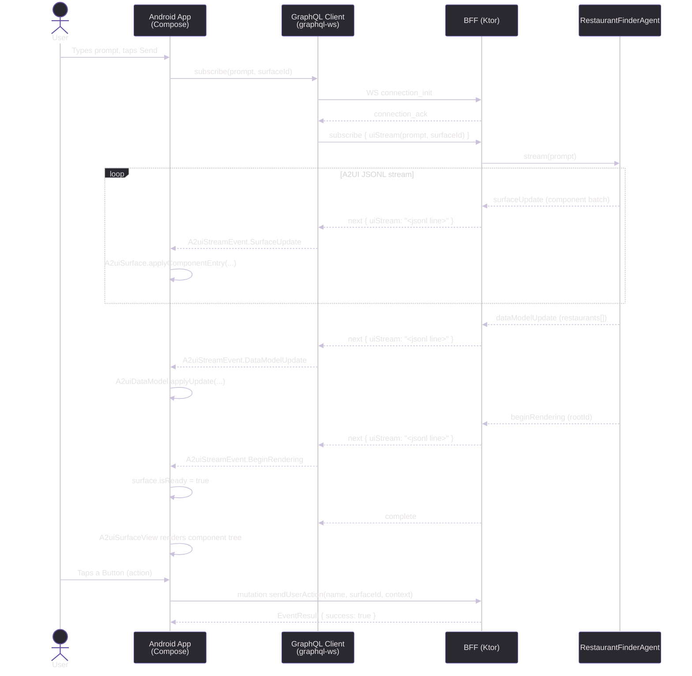

# A2UI Exploration

A monorepo demonstrating the **A2UI v0.8** protocol — a streaming, server-driven UI architecture where the server describes the entire UI as an adjacency-list component graph and the client renders it without any bespoke per-feature code.

---

## Architecture Overview

```
┌─────────────────────────┐        GraphQL / WS        ┌─────────────────────────┐
│   Android (Compose)     │ ◄─────────────────────────► │   BFF (Ktor / JVM)      │
│  com.dgurnick.android   │                             │  com.dgurnick.bff       │
│                         │  Subscription: uiStream     │                         │
│  A2uiGraphQlClient      │  Mutation:     sendAction   │  A2uiSchema (gql-k)     │
│  A2uiSurfaceManager     │  Query:        agentCard    │  RestaurantFinderAgent  │
│  A2uiRenderer (Compose) │                             │  A2uiMessages (models)  │
└─────────────────────────┘                             └─────────────────────────┘
```

---

## Sequence Diagram



---

## Tech Stack

| Layer    | Technology |
|----------|-----------|
| Android  | Kotlin 1.9.24 · Jetpack Compose (BOM 2024.06.00) · Material3 · OkHttp 4.12 · kotlinx-serialization |
| BFF      | Kotlin/JVM · Ktor 2.3.11 · graphql-kotlin-ktor-server 7.1.4 · Jackson 2.17.2 · WebSockets |
| Protocol | A2UI v0.8 — JSONL streaming over GraphQL WebSocket subscription |
| Build    | Gradle 8 (Kotlin DSL) · AGP 8.4.2 |

---

## Project Structure

```
a2ui/
├── android/                         # Android app (Jetpack Compose)
│   ├── app/src/main/kotlin/com/dgurnick/android/
│   │   ├── a2ui/
│   │   │   ├── A2uiMessages.kt      # A2UI v0.8 wire-format models
│   │   │   ├── A2uiDataModel.kt     # JSON-pointer data store + BoundValue resolver
│   │   │   ├── A2uiGraphQlClient.kt # graphql-ws subscription + HTTP mutations
│   │   │   └── A2uiRenderer.kt      # Compose widget registry + A2uiSurfaceView
│   │   └── ui/
│   │       ├── A2uiViewModel.kt     # StateFlow state, surface lifecycle
│   │       ├── A2uiApp.kt           # Root Compose screen
│   │       ├── MainActivity.kt      # ComponentActivity entry point
│   │       └── theme/               # Material3 theme (Color, Type, Theme)
│   └── gradle/libs.versions.toml
│
├── bff/                             # Backend-for-Frontend (Ktor)
│   ├── src/main/kotlin/com/dgurnick/bff/
│   │   ├── Application.kt           # Ktor app entry, GraphQL plugin
│   │   ├── graphql/A2uiSchema.kt    # Query / Mutation / Subscription schema
│   │   ├── agent/RestaurantFinderAgent.kt  # Demo agent (streaming JSONL)
│   │   ├── model/A2uiMessages.kt    # BFF-side A2UI models
│   │   ├── model/ComponentBuilders.kt      # Component DSL helpers
│   │   └── routes/A2uiRoutes.kt     # Ktor routing (POST, SDL, GraphiQL, WS)
│   └── bruno/                       # Bruno API test collection
│
└── README.md
```

---

## GraphQL API

### Query
```graphql
query {
  agentCard {
    id
    name
    description
    version
    capabilities
  }
}
```

### Subscription — A2UI stream
```graphql
subscription {
  uiStream(prompt: "Find Italian restaurants near me", surfaceId: "main")
}
```
Each `next` message carries a single JSONL line — one of:
- `{"surfaceUpdate": { "surfaceId": "...", "components": [...] }}`
- `{"dataModelUpdate": { "surfaceId": "...", "path": "/", "contents": [...] }}`
- `{"beginRendering": { "surfaceId": "...", "root": "<componentId>" }}`
- `{"deleteSurface": { "surfaceId": "..." }}`

### Mutations
```graphql
mutation {
  sendUserAction(input: { name: "search", surfaceId: "main", sourceComponentId: "searchBtn", timestamp: "...", context: "{}" }) {
    success
  }
}

mutation {
  reportError(input: { message: "render failed", componentId: "card-1" }) {
    success
  }
}
```

---

## Running Locally

### BFF
```bash
cd bff
./gradlew run
# GraphQL endpoint: http://localhost:8080/graphql
# GraphiQL UI:      http://localhost:8080/graphiql
# SDL:              http://localhost:8080/sdl
# WS subscriptions: ws://localhost:8080/subscriptions
```

### Android
1. Start the BFF (above).
2. Open `android/` in Android Studio.
3. Run on an emulator — the app connects to `http://10.0.2.2:8080` (emulator localhost alias).

---

## A2UI Protocol — Message Flow

| Step | Direction | Message | Purpose |
|------|-----------|---------|---------|
| 1 | Server → Client | `surfaceUpdate` (×N) | Stream component graph batches |
| 2 | Server → Client | `dataModelUpdate` | Populate bound data |
| 3 | Server → Client | `beginRendering` | Signal root + render start |
| 4 | Client → Server | `sendUserAction` | User interaction events |
| 5 | Server → Client | `deleteSurface` | Tear down a surface |

Components reference children by ID (adjacency list). `BoundValue` fields resolve at render time against the `A2uiDataModel` using JSON Pointer paths.

---

## Bruno Tests

API tests live in `bff/bruno/`. Import the collection in [Bruno](https://www.usebruno.com/) and select the **local** environment.
