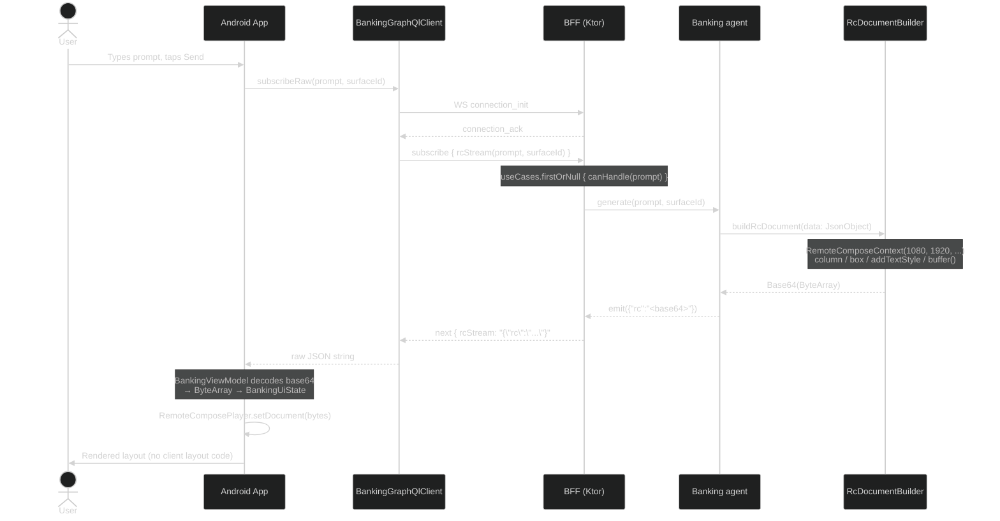

# Banking Demo — Remote Compose Exploration

This repository demonstrates **Jetpack Remote Compose** — a server-driven UI approach where the server produces a binary layout document and the Android client renders it with zero UI logic of its own. A mock banking domain (account balances, ATM finder, offers) is used to show realistic use cases.

---

## How It Compares to Traditional Server-Driven UI

Most server-driven UI frameworks (A2UI, Airbnb Ghost Platform, etc.) stream a *description* of the UI — a component graph the client interprets:
```
BFF ──{ component graph / JSONL }──► Client
                                      Client has a widget registry
                                      Client owns the rendering logic
```
With Remote Compose the server owns the rendering logic entirely:

### Remote Compose
```
BFF ──{ RC binary document }──► Android
   RemoteComposeContext             RemoteComposePlayer.setDocument(bytes)
   builds layout on the JVM         plays it — no layout logic on device
```
The server builds the *actual layout* using `RemoteComposeContext` (a pure JVM API from `androidx.compose.remote:remote-creation-core`). It serialises the result to a binary byte array, base64-encodes it, and sends it over the GraphQL subscription. The Android client only decodes the bytes and hands them to `RemoteComposePlayer`. No layout code lives on the device.

**Key difference:** with Remote Compose, changing what the user sees — layout, typography, colours, content — is a server-side change only. The app needs no update.

---

## Architecture (Remote Compose branch)

```
┌──────────────────────────────┐     GraphQL / WebSocket      ┌────────────────────────────────┐
│   Android (Compose)          │ ◄──────────────────────────► │   BFF (Ktor / JVM)             │
│  com.dgurnick.banking        │                              │  com.dgurnick.banking.bff      │
│                              │  Subscription: rcStream      │                                │
│  BankingGraphQlClient        │  Mutation:     sendAction    │  BankingSchema (graphql-kotlin)│
│  BankingViewModel            │  Query:        agentCard     │  UseCase (interface)           │
│  RcDocumentView              │                              │  Banking agents (4)            │
│  RemoteComposePlayer         │  {"rc":"<base64 bytes>"}     │  RcDocumentBuilder             │
└──────────────────────────────┘                              └────────────────────────────────┘
```

---

## Sequence Diagram



---

## Tech Stack

| Layer   | Technology |
|---------|-----------|
| Android | Kotlin · Jetpack Compose (BOM 2024.06.00) · Material3 · OkHttp 4.12 · kotlinx-serialization · `remote-core` · `remote-player-core` · `remote-player-view` |
| BFF     | Kotlin 2.1.20 · Ktor 2.3.11 · graphql-kotlin-ktor-server 7.1.4 · `remote-creation-core:1.0.0-alpha06` · `remote-core:1.0.0-alpha06` |
| Protocol | GraphQL subscription (graphql-transport-ws) · `{"rc":"<base64 RC binary>"}` |
| Build   | Gradle 8 (Kotlin DSL) · AGP 8.4.2 |

---

## Project Structure

```
banking-demo/
├── android/                              # Android app (Jetpack Compose)
│   └── app/src/main/kotlin/com/dgurnick/banking/
│       ├── client/
│       │   ├── BankingGraphQlClient.kt   # graphql-ws subscription + HTTP mutations
│   │   ├── BankingMessages.kt        # GraphQL wire-format models
│       │   └── RcDocumentView.kt         # AndroidView wrapping RemoteComposePlayer
│       └── ui/
│           ├── BankingViewModel.kt       # StateFlow state; base64-decodes RC bytes from BFF
│           ├── BankingApp.kt             # Root Compose screen (prompt bar + RC player)
│           ├── MainActivity.kt           # ComponentActivity entry point
│           └── theme/                    # Material3 theme (Color, BankingTheme, Type)
│
├── bff/                                  # Backend-for-Frontend (Ktor)
│   └── src/main/kotlin/com/dgurnick/banking/bff/
│       ├── Application.kt                # Ktor app entry, GraphQL plugin
│       ├── graphql/BankingSchema.kt      # Query / Mutation / Subscription schema
│       ├── usecase/UseCase.kt            # UseCase interface (canHandle + generate)
│       ├── agent/RcDocumentBuilder.kt    # ★ SERVER-SIDE RC creation (RemoteComposeContext)
│       ├── agent/AccountBalanceAgent.kt  # "What is my account balance?"
│       ├── agent/AtmFinderAgent.kt       # "Where is the nearest ATM?"
│       ├── agent/BankOffersAgent.kt      # "What offers do you have for me?"
│       ├── agent/FallbackAgent.kt        # Catch-all
│       ├── model/BankingMessages.kt      # BFF-side models
│       ├── model/ComponentBuilders.kt    # Component DSL helpers
│       └── routes/BankingRoutes.kt       # Ktor routing (POST, SDL, GraphiQL, WS)
│
└── README.md
```

---

## GraphQL API

### Subscription — RC document stream
```graphql
subscription {
  rcStream(prompt: "What is my account balance?", surfaceId: "main")
}
```

Each `next` payload contains a single JSON object:
```json
{ "rc": "<base64-encoded Remote Compose binary document>" }
```

Example prompts:

| Prompt | Agent |
|--------|-------|
| "Where is the nearest ATM?" / "closest cash machine" | `AtmFinderAgent` |
| "What is my account balance?" / "show transactions" | `AccountBalanceAgent` |
| "What offers do you have?" / "any loan deals?" | `BankOffersAgent` |
| _(anything else)_ | `FallbackAgent` |

### Query
```graphql
query {
  agentCard {
    name
    description
    version
    supportedCatalogIds
    acceptsInlineCatalogs
  }
}
```

### Mutations
```graphql
mutation {
  sendUserAction(input: { name: "search", surfaceId: "main",
    sourceComponentId: "searchBtn", timestamp: "...", context: "{}" }) {
    status
  }
}

mutation {
  reportError(input: { message: "render failed", componentId: "card-1" }) {
    status
  }
}
```

---

## Running Locally

### BFF
```bash
cd bff
./gradlew run
# GraphQL endpoint: http://localhost:8080/graphql
# GraphiQL UI:      http://localhost:8080/graphiql
# SDL:              http://localhost:8080/sdl
# WS subscriptions: ws://localhost:8080/subscriptions
```

### Android
1. Start the BFF (above).
2. Open `android/` in Android Studio.
3. Run on an emulator — the app connects to `http://10.0.2.2:8080` (emulator → host alias).

---

## Key Implementation Detail — `RcDocumentBuilder.kt`

All layout creation is in [`bff/…/agent/RcDocumentBuilder.kt`](bff/src/main/kotlin/com/dgurnick/banking/bff/agent/RcDocumentBuilder.kt). It uses the pure-JVM `RemoteComposeContext` API:

```kotlin
fun buildRcDocument(data: JsonObject): String {
    val ctx = RemoteComposeContext(1080, 1920, type, RcPlatformServices.None)
    ctx.column(RecordingModifier().fillMaxSize().padding(24f), 0, 0) {
        // lambda-with-receiver: this = RemoteComposeContext
        val titleStyle = addTextStyle(null, null, 22f, ...)
        box(RecordingModifier().fillMaxWidth(), 0, 0) {
            drawTextAnchored("Good morning, Alex", 0f, 0f, 1080f, 56f, titleStyle)
        }
    }
    return Base64.getEncoder().encodeToString(ctx.buffer())
}
```

The Android client receives the base64 string and renders it with no layout logic:

```kotlin
val bytes = Base64.decode(rcBase64, Base64.DEFAULT)
RemoteComposePlayer(context).setDocument(bytes)
```

---

## Bruno Tests

API tests live in `bff/bruno/`. Import the collection in [Bruno](https://www.usebruno.com/) and select the **local** environment.

---

## Design Decisions — Pros & Cons

### Remote Compose: server-owned layout

| | |
|---|---|
| **Pro** | Zero layout code on the device. Any layout change — typography, spacing, new content — is a BFF-only change with no app update required. |
| **Pro** | No widget registry schema drift. The server constructs whatever layout it needs; the client is a pure player. |
| **Pro** | `RemoteComposeContext` is a pure JVM API — the BFF has no Android dependency and can be unit-tested as ordinary JVM code. |
| **Con** | RC documents are binary and opaque — harder to inspect mid-stream than plain JSON. |
| **Con** | `RemoteComposeContext` API is alpha (`1.0.0-alpha06`). Surface area and behaviour may change before stable release. |
| **Con** | The player only renders; it cannot trigger local device behaviour (camera, biometrics, etc.) without a separate side-channel. |

---

### GraphQL WebSocket subscription for streaming

| | |
|---|---|
| **Pro** | Typed contract between client and server; GraphiQL works out of the box for debugging. |
| **Pro** | graphql-kotlin generates the schema from annotated Kotlin classes — no separate SDL to maintain. |
| **Con** | The `next` payload is a stringly-typed `String`. GraphQL's type system adds no value for the RC binary blob. |
| **Con** | Meaningful framing overhead per message; a plain WebSocket or SSE would be lighter for a single large binary payload. |

---

### Ktor as the BFF runtime

| | |
|---|---|
| **Pro** | Minimal footprint, coroutine-native, starts in under a second, packages cleanly as a shadow JAR. |
| **Con** | Thinner plugin ecosystem than Spring Boot — logging, metrics, and tracing require more manual wiring. |

---

### UseCase / `canHandle` dispatch

| | |
|---|---|
| **Pro** | Simple to extend — implement two methods, add to the list in `Application.kt`. |
| **Con** | Keyword matching is brittle; production use would need an intent-classification model or LLM routing. |

---

## Remote Compose Limitations

Remote Compose renders **static server-generated UI**. The server builds the layout once, serializes it to bytes, and the client plays it back. This architecture has inherent limitations:

### No Native Interactivity

| Feature | Limitation | Workaround |
|---------|------------|------------|
| **Interactive Maps** | RC cannot embed a zoomable/scrollable map (Google Maps, OSM). Drawing primitives like `drawRect`, `drawOval`, and `drawLine` can render a static map illustration, but it won't support pinch-to-zoom, pan gestures, or real tile loading. | Send location data as structured JSON alongside (or instead of) the RC document. The Android client renders a native `MapView` using that data. |
| **Expandable/Collapsible Content** | RC has no state — once rendered, it cannot respond to tap events that toggle visibility. | Send structured data and let the client render native Compose `AnimatedVisibility` or `ExpandableCard` components. |
| **Form Input** | RC cannot capture text input, checkboxes, or other form controls. | Use a hybrid approach: RC for display, native components for input, with mutations to send data back to the BFF. |
| **Animations** | RC documents are static snapshots. Animated transitions, loading spinners, or morphing layouts are not supported. | The client can animate *around* the RC content (e.g., fade-in), but the RC content itself is static. |
| **Device APIs** | RC cannot trigger camera, biometrics, location services, or other device capabilities. | The client must handle these separately and pass results to the BFF via mutations. |

### When to Use Native Components Instead

If your use case requires:
- **Maps with zoom/pan** → Use native MapView + structured location data
- **Expand/collapse cards** → Use native Compose with structured offer data  
- **Pull-to-refresh** → Wrap RC in native `SwipeRefresh`
- **Tap actions that change state** → Use native components or hybrid approach
- **Real-time updates** → Re-fetch/re-render the entire RC document

### Hybrid Architecture Pattern

For features requiring interactivity, the BFF can send both:
1. **RC document** — for static, styled content (headers, descriptions, styled text)
2. **Structured JSON data** — for interactive elements the client renders natively

```json
{
  "rc": "<base64 RC document for static header>",
  "mapData": {
    "userLat": 37.786,
    "userLon": -122.407,
    "markers": [
      { "lat": 37.788, "lon": -122.405, "title": "ATM 1", "distance": "0.2 mi" }
    ]
  }
}
```

The Android client:
- Renders `rc` with `RemoteComposePlayer` for the styled header
- Renders `mapData` with a native interactive `MapView`

This preserves the server-driven philosophy while enabling full native interactivity where needed.
