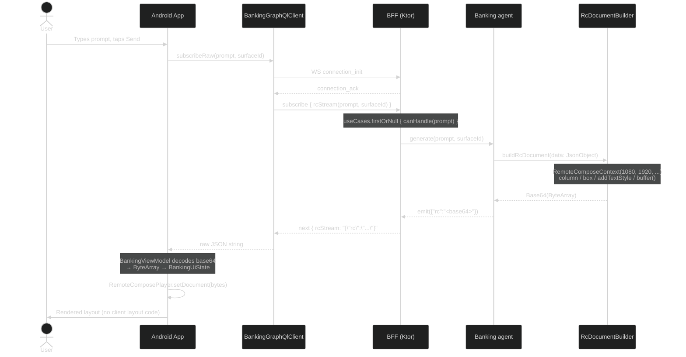

# Banking Demo — Remote Compose Exploration

This repository demonstrates **Jetpack Remote Compose** — a server-driven UI approach where the server produces a binary layout document and the Android client renders it with zero UI logic of its own. A mock banking domain (account balances, ATM finder, offers) is used to show realistic use cases.

---

## Demo

<video src="demo.mp4" width="360" controls autoplay loop muted></video>

**Features demonstrated:**
- **ATM Finder** — Interactive OpenStreetMap with pinch-to-zoom, pan gestures, and auto-filtering ATM list
- **Account Balance** — Server-rendered Remote Compose document
- **Offers** — Native expandable cards with tap-to-expand interactions

---

## How It Compares to Traditional Server-Driven UI

Most server-driven UI frameworks (A2UI, Airbnb Ghost Platform, etc.) stream a *description* of the UI — a component graph the client interprets:
```
BFF ──{ component graph / JSONL }──► Client
                                      Client has a widget registry
                                      Client owns the rendering logic
```
With Remote Compose the server owns the rendering logic entirely:

### Remote Compose
```
BFF ──{ RC binary document }──► Android
   RemoteComposeContext             RemoteComposePlayer.setDocument(bytes)
   builds layout on the JVM         plays it — no layout logic on device
```
The server builds the *actual layout* using `RemoteComposeContext` (a pure JVM API from `androidx.compose.remote:remote-creation-core`). It serialises the result to a binary byte array, base64-encodes it, and sends it over the GraphQL subscription. The Android client only decodes the bytes and hands them to `RemoteComposePlayer`. No layout code lives on the device.

**Key difference:** with Remote Compose, changing what the user sees — layout, typography, colours, content — is a server-side change only. The app needs no update.

> **💡 The Power of Server-Driven UI**
>
> Adding an entirely new feature — like the `LoanOffersAgent` with its multi-step conversational flow — requires **only a BFF rebuild**. The Android app remains unchanged and immediately supports the new workflow. No app store submission, no user update prompt, no version fragmentation. This is the core value proposition of server-driven architecture.

---

## Architecture (Remote Compose branch)

```
┌──────────────────────────────┐     GraphQL / WebSocket      ┌────────────────────────────────┐
│   Android (Compose)          │ ◄──────────────────────────► │   BFF (Ktor / JVM)             │
│  com.dgurnick.banking        │                              │  com.dgurnick.banking.bff      │
│                              │  Subscription: rcStream      │                                │
│  BankingGraphQlClient        │  Mutation:     sendAction    │  BankingSchema (graphql-kotlin)│
│  BankingViewModel            │  Query:        agentCard     │  UseCase (interface)           │
│  RcDocumentView              │                              │  Banking agents (4)            │
│  RemoteComposePlayer         │  {"rc":"<base64 bytes>"}     │  RcDocumentBuilder             │
└──────────────────────────────┘                              └────────────────────────────────┘
```

---

## Sequence Diagram



---

## Tech Stack

| Layer   | Technology |
|---------|-----------|
| Android | Kotlin · Jetpack Compose (BOM 2024.06.00) · Material3 · OkHttp 4.12 · kotlinx-serialization · `remote-core` · `remote-player-core` · `remote-player-view` |
| BFF     | Kotlin 2.1.20 · Ktor 2.3.11 · graphql-kotlin-ktor-server 7.1.4 · `remote-creation-core:1.0.0-alpha06` · `remote-core:1.0.0-alpha06` |
| Protocol | GraphQL subscription (graphql-transport-ws) · `{"rc":"<base64 RC binary>"}` |
| Build   | Gradle 8 (Kotlin DSL) · AGP 8.4.2 |

---

## Project Structure

```
banking-demo/
├── android/                              # Android app (Jetpack Compose)
│   └── app/src/main/kotlin/com/dgurnick/banking/
│       ├── client/
│       │   ├── BankingGraphQlClient.kt   # graphql-ws subscription + HTTP mutations
│   │   ├── BankingMessages.kt        # GraphQL wire-format models
│       │   └── RcDocumentView.kt         # AndroidView wrapping RemoteComposePlayer
│       └── ui/
│           ├── BankingViewModel.kt       # StateFlow state; base64-decodes RC bytes from BFF
│           ├── BankingApp.kt             # Root Compose screen (prompt bar + RC player)
│           ├── MainActivity.kt           # ComponentActivity entry point
│           └── theme/                    # Material3 theme (Color, BankingTheme, Type)
│
├── bff/                                  # Backend-for-Frontend (Ktor)
│   └── src/main/kotlin/com/dgurnick/banking/bff/
│       ├── Application.kt                # Ktor app entry, GraphQL plugin
│       ├── graphql/BankingSchema.kt      # Query / Mutation / Subscription schema
│       ├── usecase/UseCase.kt            # UseCase interface (canHandle + generate)
│       ├── agent/RcDocumentBuilder.kt    # ★ SERVER-SIDE RC creation (RemoteComposeContext)
│       ├── agent/AccountBalanceAgent.kt  # "What is my account balance?"
│       ├── agent/AtmFinderAgent.kt       # "Where is the nearest ATM?"
│       ├── agent/BankOffersAgent.kt      # "What offers do you have for me?"
│       ├── agent/FallbackAgent.kt        # Catch-all
│       ├── model/BankingMessages.kt      # BFF-side models
│       ├── model/ComponentBuilders.kt    # Component DSL helpers
│       └── routes/BankingRoutes.kt       # Ktor routing (POST, SDL, GraphiQL, WS)
│
└── README.md
```

---

## GraphQL API

### Full Schema (SDL)

```graphql
type Query {
  agentCard: AgentCard!
}

type Mutation {
  sendUserAction(input: UserActionInput!): EventResult!
  reportError(input: ClientErrorInput!): EventResult!
}

type Subscription {
  uiStream(prompt: String!, surfaceId: String! = "main"): String!
}

type AgentCard {
  name: String!
  description: String!
  version: String!
  supportedCatalogIds: [String!]!
  acceptsInlineCatalogs: Boolean!
}

type EventResult {
  status: String!
  received: Boolean!
}

input UserActionInput {
  name: String!
  surfaceId: String!
  sourceComponentId: String!
  timestamp: String!
  context: String!
}

input ClientErrorInput {
  message: String!
  componentId: String
  details: String
}
```

### Subscription — `uiStream`

The main interface for streaming UI updates to the client.

```graphql
subscription {
  uiStream(prompt: "What is my account balance?", surfaceId: "main")
}
```

The subscription uses the **graphql-transport-ws** protocol over WebSocket at `ws://localhost:8080/subscriptions`.

#### Response Formats

Each `next` payload is a JSON string with a `type` discriminator:

| Type | Format | Description |
|------|--------|-------------|
| `rc` | `{"type": "rc", "rc": "<base64>"}` | Remote Compose binary document (base64-encoded) |
| `map` | `{"type": "map", "mapData": {...}}` | Native map data for interactive maps |
| `offers` | `{"type": "offers", "offersData": {...}}` | Native offers data for expandable cards |
| `chat` | `{"type": "chat", "text": "...", "buttons": [...]}` | Conversational response with optional buttons |

**Remote Compose Response:**
```json
{
  "type": "rc",
  "rc": "AQAAAAEAAAABAAAAAgAA..."
}
```

**Map Response:**
```json
{
  "type": "map",
  "mapData": {
    "centerLat": 40.7128,
    "centerLng": -74.006,
    "zoom": 15.0,
    "markers": [
      { "id": "atm-1", "lat": 40.7130, "lng": -74.007, "title": "Chase ATM" }
    ]
  }
}
```

**Offers Response:**
```json
{
  "type": "offers",
  "offersData": {
    "title": "We have these offers for you!",
    "offers": [
      { "id": "1", "title": "Cash Back Rewards", "description": "...", "actionText": "Learn More" }
    ]
  }
}
```

**Chat Response:**
```json
{
  "type": "chat",
  "text": "How much would you like to borrow?",
  "buttons": ["$1,000", "$5,000", "$10,000", "$25,000", "$50,000"]
}
```

#### Agent Routing

| Prompt Pattern | Agent |
|----------------|-------|
| "nearest ATM" / "closest cash machine" | `AtmFinderAgent` |
| "account balance" / "show transactions" | `AccountBalanceAgent` |
| "personal loan" / loan amount/purpose selections | `LoanOffersAgent` |
| "offers" / "deals" / "promotions" | `BankOffersAgent` |
| _(anything else)_ | `FallbackAgent` |

### Query — `agentCard`

Returns metadata about the agent's capabilities (A2A protocol).

```graphql
query {
  agentCard {
    name
    description
    version
    supportedCatalogIds
    acceptsInlineCatalogs
  }
}
```

**Response:**
```json
{
  "data": {
    "agentCard": {
      "name": "Banking BFF Agent",
      "description": "Backend-for-frontend banking agent",
      "version": "1.0.0",
      "supportedCatalogIds": [],
      "acceptsInlineCatalogs": false
    }
  }
}
```

### Mutations

#### `sendUserAction`

Reports user interactions (button taps, navigation) back to the BFF.

```graphql
mutation {
  sendUserAction(input: {
    name: "button_tap",
    surfaceId: "main",
    sourceComponentId: "offer-card-1",
    timestamp: "2024-01-15T10:30:00Z",
    context: "{\"action\": \"apply_now\"}"
  }) {
    status
    received
  }
}
```

#### `reportError`

Reports client-side errors for debugging and monitoring.

```graphql
mutation {
  reportError(input: {
    message: "Failed to decode RC document",
    componentId: "rc-player-main",
    details: "Base64 decode error at position 1024"
  }) {
    status
    received
  }
}
```

---

## Running Locally

### BFF
```bash
cd bff
./gradlew run
# GraphQL endpoint: http://localhost:8080/graphql
# GraphiQL UI:      http://localhost:8080/graphiql
# SDL:              http://localhost:8080/sdl
# WS subscriptions: ws://localhost:8080/subscriptions
```

### Android
1. Start the BFF (above).
2. Open `android/` in Android Studio.
3. Run on an emulator — the app connects to `http://10.0.2.2:8080` (emulator → host alias).

---

## Key Implementation Detail — `RcDocumentBuilder.kt`

All layout creation is in [`bff/…/agent/RcDocumentBuilder.kt`](bff/src/main/kotlin/com/dgurnick/banking/bff/agent/RcDocumentBuilder.kt). It uses the pure-JVM `RemoteComposeContext` API:

```kotlin
fun buildRcDocument(data: JsonObject): String {
    val ctx = RemoteComposeContext(1080, 1920, type, RcPlatformServices.None)
    ctx.column(RecordingModifier().fillMaxSize().padding(24f), 0, 0) {
        // lambda-with-receiver: this = RemoteComposeContext
        val titleStyle = addTextStyle(null, null, 22f, ...)
        box(RecordingModifier().fillMaxWidth(), 0, 0) {
            drawTextAnchored("Good morning, Fadi", 0f, 0f, 1080f, 56f, titleStyle)
        }
    }
    return Base64.getEncoder().encodeToString(ctx.buffer())
}
```

The Android client receives the base64 string and renders it with no layout logic:

```kotlin
val bytes = Base64.decode(rcBase64, Base64.DEFAULT)
RemoteComposePlayer(context).setDocument(bytes)
```

---

## Bruno Tests

API tests live in `bff/bruno/`. Import the collection in [Bruno](https://www.usebruno.com/) and select the **local** environment.

---

## Design Decisions — Pros & Cons

### Remote Compose: server-owned layout

| | |
|---|---|
| **Pro** | Zero layout code on the device. Any layout change — typography, spacing, new content — is a BFF-only change with no app update required. |
| **Pro** | No widget registry schema drift. The server constructs whatever layout it needs; the client is a pure player. |
| **Pro** | `RemoteComposeContext` is a pure JVM API — the BFF has no Android dependency and can be unit-tested as ordinary JVM code. |
| **Con** | RC documents are binary and opaque — harder to inspect mid-stream than plain JSON. |
| **Con** | `RemoteComposeContext` API is alpha (`1.0.0-alpha06`). Surface area and behaviour may change before stable release. |
| **Con** | The player only renders; it cannot trigger local device behaviour (camera, biometrics, etc.) without a separate side-channel. |

---

### GraphQL WebSocket subscription for streaming

| | |
|---|---|
| **Pro** | Typed contract between client and server; GraphiQL works out of the box for debugging. |
| **Pro** | graphql-kotlin generates the schema from annotated Kotlin classes — no separate SDL to maintain. |
| **Con** | The `next` payload is a stringly-typed `String`. GraphQL's type system adds no value for the RC binary blob. |
| **Con** | Meaningful framing overhead per message; a plain WebSocket or SSE would be lighter for a single large binary payload. |

---

### Ktor as the BFF runtime

| | |
|---|---|
| **Pro** | Minimal footprint, coroutine-native, starts in under a second, packages cleanly as a shadow JAR. |
| **Con** | Thinner plugin ecosystem than Spring Boot — logging, metrics, and tracing require more manual wiring. |

---

### UseCase / `canHandle` dispatch

| | |
|---|---|
| **Pro** | Simple to extend — implement two methods, add to the list in `Application.kt`. |
| **Con** | Keyword matching is brittle; production use would need an intent-classification model or LLM routing. |

---

## Remote Compose Limitations

Remote Compose renders **static server-generated UI**. The server builds the layout once, serializes it to bytes, and the client plays it back. This architecture has inherent limitations:

### No Native Interactivity

| Feature | Limitation | Workaround |
|---------|------------|------------|
| **Interactive Maps** | RC cannot embed a zoomable/scrollable map (Google Maps, OSM). Drawing primitives like `drawRect`, `drawOval`, and `drawLine` can render a static map illustration, but it won't support pinch-to-zoom, pan gestures, or real tile loading. | Send location data as structured JSON alongside (or instead of) the RC document. The Android client renders a native `MapView` using that data. |
| **Expandable/Collapsible Content** | RC has no state — once rendered, it cannot respond to tap events that toggle visibility. | Send structured data and let the client render native Compose `AnimatedVisibility` or `ExpandableCard` components. |
| **Form Input** | RC cannot capture text input, checkboxes, or other form controls. | Use a hybrid approach: RC for display, native components for input, with mutations to send data back to the BFF. |
| **Animations** | RC documents are static snapshots. Animated transitions, loading spinners, or morphing layouts are not supported. | The client can animate *around* the RC content (e.g., fade-in), but the RC content itself is static. |
| **Device APIs** | RC cannot trigger camera, biometrics, location services, or other device capabilities. | The client must handle these separately and pass results to the BFF via mutations. |

### When to Use Native Components Instead

If your use case requires:
- **Maps with zoom/pan** → Use native MapView + structured location data
- **Expand/collapse cards** → Use native Compose with structured offer data  
- **Pull-to-refresh** → Wrap RC in native `SwipeRefresh`
- **Tap actions that change state** → Use native components or hybrid approach
- **Real-time updates** → Re-fetch/re-render the entire RC document

### Hybrid Architecture Pattern

For features requiring interactivity, the BFF can send both:
1. **RC document** — for static, styled content (headers, descriptions, styled text)
2. **Structured JSON data** — for interactive elements the client renders natively

```json
{
  "rc": "<base64 RC document for static header>",
  "mapData": {
    "userLat": 37.786,
    "userLon": -122.407,
    "markers": [
      { "lat": 37.788, "lon": -122.405, "title": "ATM 1", "distance": "0.2 mi" }
    ]
  }
}
```

The Android client:
- Renders `rc` with `RemoteComposePlayer` for the styled header
- Renders `mapData` with a native interactive `MapView`

This preserves the server-driven philosophy while enabling full native interactivity where needed.

---

## Agent Architecture

The BFF uses a simple **agent-based routing pattern**. Each agent implements the `UseCase` interface with two methods:
- `canHandle(prompt, conversation)` — returns `true` if this agent should process the prompt
- `generate(prompt, surfaceId, conversation)` — produces the response (RC document, JSON data, or chat message)

Agents are evaluated in order; the first agent whose `canHandle()` returns `true` wins.

### Current Agents

| Agent | Purpose | Response Type | Triggers |
|-------|---------|---------------|----------|
| **AtmFinderAgent** | Locates nearby ATMs | Native map data | "nearest ATM", "cash machine", "withdraw" |
| **AccountBalanceAgent** | Shows account balances | Remote Compose | "balance", "account", "statement" |
| **LoanOffersAgent** | Multi-step loan application workflow | Chat with buttons | "personal loan", "borrow", loan amount/purpose selections |
| **BankOffersAgent** | Displays promotional offers | Native offers data | "offers", "deals", "promotions" |
| **SummaryAgent** | End-of-conversation summary | Chat with buttons | "no thanks", "goodbye", "start over" |
| **FallbackAgent** | Catch-all for unrecognized prompts | Remote Compose | _(anything else)_ |

### Agent Replacement Options

Each agent represents a discrete capability that could be replaced by in-house solutions or external services:

#### AtmFinderAgent
| Replacement | Integration |
|-------------|-------------|
| **In-house** | Connect to your own ATM/branch locator database. Replace the mock data with real lat/lon queries against your location service. |
| **Google Places API** | Use `nearbysearch` with `type=atm` to get real ATM locations near the user. |
| **HERE Places API** | Enterprise-grade POI search with ATM category filtering. |
| **Mastercard ATM Locator API** | Access to Mastercard's global ATM network. |

#### AccountBalanceAgent
| Replacement | Integration |
|-------------|-------------|
| **In-house Core Banking** | Call your core banking system's account inquiry API. Replace mock data with real balances from your CBS. |
| **Plaid** | Aggregated account balances from linked external accounts. |
| **MX** | Financial data aggregation platform for account information. |
| **Yodlee** | Envestnet Yodlee for multi-institution account access. |

#### LoanOffersAgent
| Replacement | Integration |
|-------------|-------------|
| **In-house LOS** | Integrate with your Loan Origination System for real rates and eligibility. |
| **Blend** | Digital lending platform API for loan applications. |
| **Roostify** | Mortgage and consumer lending automation. |
| **Upstart** | AI-powered lending platform for personal loans. |
| **LLM Agent** | Replace keyword matching with an LLM (GPT-4, Claude, Gemini) for natural conversation and intent understanding. |

#### BankOffersAgent
| Replacement | Integration |
|-------------|-------------|
| **In-house Marketing** | Pull personalized offers from your CRM or marketing automation platform. |
| **Cardlytics** | Purchase-based card-linked offers. |
| **Finastra FusionFabric** | Marketplace offers and partner integrations. |
| **Personetics** | AI-driven personalized financial insights and offers. |

#### SummaryAgent
| Replacement | Integration |
|-------------|-------------|
| **LLM Summarization** | Use an LLM to generate natural, context-aware conversation summaries instead of rule-based extraction. |
| **In-house Analytics** | Log conversation events to your analytics platform and generate summaries from tracked actions. |

#### FallbackAgent
| Replacement | Integration |
|-------------|-------------|
| **LLM Router** | Use an LLM to classify intent and either answer directly or route to specialized agents. |
| **Dialogflow CX** | Google's conversational AI for intent classification and response generation. |
| **Amazon Lex** | AWS conversational AI service with built-in NLU. |
| **Rasa** | Open-source conversational AI framework for on-premise deployment. |

### Extending with New Agents

To add a new agent:

1. **Create the agent class** implementing `UseCase`:
```kotlin
class MyNewAgent : UseCase {
    override fun canHandle(prompt: String, conversation: Conversation): Boolean {
        // Return true if this agent should handle the prompt
        return prompt.lowercase().contains("my keyword")
    }

    override fun generate(
        prompt: String,
        surfaceId: String,
        conversation: Conversation
    ): Flow<String> = flow {
        // Return RC document, structured JSON, or chat response
        emit(buildJsonObject {
            put("type", "chat")
            put("text", "Response text")
        }.toString())
    }
}
```

2. **Register in Application.kt**:
```kotlin
val useCases: List<UseCase> = listOf(
    // ... existing agents ...
    MyNewAgent(),  // Add before FallbackAgent
    FallbackAgent(), // catch-all — must be last
)
```

3. **Rebuild the BFF** — the Android app requires no changes.

### Production Considerations

The current keyword-based `canHandle()` routing is suitable for demos but fragile for production:

| Challenge | Production Solution |
|-----------|-------------------|
| **Intent ambiguity** | Use an LLM or NLU model (Dialogflow, Rasa, etc.) for robust intent classification |
| **Multi-turn context** | The `Conversation` object tracks history; consider vector embeddings for semantic context |
| **Agent conflicts** | Implement confidence scoring to handle overlapping triggers |
| **Scalability** | Consider agent microservices for independent scaling and deployment |
| **Monitoring** | Add tracing (OpenTelemetry) to track agent selection and performance |

---

## Technical Spike Summary

This repository represents a **proof-of-concept technical spike** exploring server-driven UI with Remote Compose. The following summarizes the custom logic implemented in each layer.

### Android App — Custom Logic

The Android app is intentionally thin. Its job is to receive server responses and render them. Custom logic is limited to:

| Component | Custom Logic | Lines of Code |
|-----------|--------------|---------------|
| **BankingGraphQlClient** | GraphQL WebSocket subscription management, connection_init/ack handshake, raw JSON streaming | ~120 |
| **BankingViewModel** | Response type parsing (`chat`, `map`, `offers`, `action`, `rc`), message list state management, offer selection tracking | ~200 |
| **BankingApp** | Chat UI layout (LazyColumn of messages), button click handlers, "Start over" client-side reset, location permission integration | ~250 |
| **InteractiveMapView** | Native OpenStreetMap rendering with zoom/pan, marker clustering, auto-scroll list on marker tap | ~180 |
| **ExpandableOffersView** | Native expandable cards with AnimatedVisibility, offer selection state (hides non-selected, disables button) | ~150 |
| **RcDocumentView** | AndroidView wrapper for RemoteComposePlayer, bytes → rendered layout | ~40 |
| **InteractiveModels** | Data classes for ChatMessage (BotMessage, UserMessage, ContentMessage, LoadingMessage), MapData, OffersData, Offer | ~100 |

**Total Android custom logic: ~1,040 lines**

#### Key Android Implementation Details

1. **Message Type Handling**: The ViewModel parses JSON response types and routes to appropriate rendering:
   - `chat` → BotMessageBubble with optional buttons
   - `map` → Native InteractiveMapView with OpenStreetMap
   - `offers` → Native ExpandableOffersView cards
   - `rc` → RemoteComposePlayer for server-rendered layouts
   - `action` → Client-side actions (e.g., `reset_conversation`)

2. **Stateful Interactions**: 
   - Buttons are hidden after use (`buttonsUsed` flag)
   - Offers collapse to show only selected offer (`selectedOfferId` tracking)
   - "Start over" triggers client-side reset without server round-trip

3. **Location Integration**: User location is captured via FusedLocationProviderClient and appended to ATM-finder prompts.

---

### BFF Server — Custom Logic

The BFF contains the bulk of the application logic. It owns routing, conversation state, and UI construction.

| Component | Custom Logic | Lines of Code |
|-----------|--------------|---------------|
| **Application.kt** | Ktor app setup, GraphQL plugin configuration, agent registration order | ~60 |
| **BankingSchema.kt** | GraphQL schema (Query, Mutation, Subscription), agent card metadata, conversation management | ~150 |
| **ConversationManager** | In-memory conversation history per surfaceId, message append/clear operations | ~50 |
| **RcDocumentBuilder** | Remote Compose document creation using RemoteComposeContext, layout builders for balance/map/offers/fallback | ~250 |
| **AtmFinderAgent** | Mock ATM data, location parsing from prompt, JSON map response construction | ~100 |
| **AccountBalanceAgent** | Mock account data, RcDocumentBuilder invocation for balance display | ~80 |
| **LoanOffersAgent** | **Multi-step state machine** (INITIAL → WAITING_AMOUNT → WAITING_PURPOSE → OFFER_SHOWN), loan offer calculation, goodbye phrase exclusion | ~220 |
| **BankOffersAgent** | Mock offers data, JSON offers response with CTA actions | ~130 |
| **SummaryAgent** | Goodbye detection, conversation summary generation, "Start over" action response | ~130 |
| **FallbackAgent** | Generic "I don't understand" response with suggested prompts | ~50 |

**Total BFF custom logic: ~1,220 lines**

#### Key BFF Implementation Details

1. **Agent Routing**: First-match-wins pattern with ordered agent list. Each agent's `canHandle()` uses keyword matching (production would use NLU/LLM).

2. **Conversation State**: `ConversationManager` maintains per-surface conversation history. `LoanOffersAgent` uses conversation context to track its state machine step.

3. **Response Types**: Agents emit different response formats:
   - Remote Compose (base64 binary) for styled layouts
   - Structured JSON (`mapData`, `offersData`) for native interactive components
   - Chat messages with buttons for conversational flows
   - Actions for client-side commands (`reset_conversation`)

4. **State Machine Example** (LoanOffersAgent):
   ```
   INITIAL ──► user says "personal loan" ──► WAITING_AMOUNT
   WAITING_AMOUNT ──► user selects "$5,000" ──► WAITING_PURPOSE  
   WAITING_PURPOSE ──► user selects "Debt Consolidation" ──► OFFER_SHOWN
   OFFER_SHOWN ──► user says "Yes, start my application" ──► Application submitted
   OFFER_SHOWN ──► user says "No, that's all" ──► SummaryAgent takes over
   ```

---

### What This Spike Demonstrates

| Capability | Evidence |
|------------|----------|
| **Server-driven UI** | Layout changes (typography, spacing, content) require only BFF rebuild — no app update |
| **Hybrid native + RC rendering** | Interactive maps and expandable cards rendered natively; styled content via RC |
| **Multi-turn conversations** | LoanOffersAgent maintains state across multiple user inputs |
| **Agent extensibility** | Adding SummaryAgent required zero Android changes |
| **Response polymorphism** | Single subscription handles chat, maps, offers, RC, and actions |
| **Client-side state management** | Buttons disable after use, offers collapse to selection |

---

### Effort Breakdown

| Phase | Effort | Notes |
|-------|--------|-------|
| **Initial scaffolding** | 2 days | Ktor BFF, GraphQL schema, Android app shell, RC player integration |
| **ATM Finder with native map** | 1 day | OpenStreetMap integration, marker rendering, auto-scroll list |
| **Account Balance (RC)** | 0.5 days | RcDocumentBuilder, styled text layout |
| **Offers with expandable cards** | 1 day | Native Compose cards, expand/collapse animation, CTA handling |
| **LoanOffersAgent state machine** | 1 day | Multi-step conversation flow, state tracking, offer calculation |
| **SummaryAgent** | 0.5 days | Goodbye detection, conversation summary, reset functionality |
| **Offer selection UX** | 0.5 days | Hide non-selected offers, disable button, checkmark prefix |
| **Testing & polish** | 1 day | Bruno tests, error handling, demo video capture |

**Total estimated effort: ~7.5 days**

---

### Production Gaps

This spike is suitable for demonstrating the architecture but requires additional work for production:

| Gap | Production Requirement |
|-----|----------------------|
| **Authentication** | Add OAuth2/OIDC for user authentication; scope conversations to authenticated users |
| **Real data sources** | Replace mock data with calls to core banking, location services, loan origination systems |
| **Intent classification** | Replace keyword matching with NLU model or LLM for robust intent understanding |
| **Persistence** | Store conversation history in a database (Redis, PostgreSQL) instead of in-memory |
| **Rate limiting** | Add API rate limiting and throttling |
| **Observability** | OpenTelemetry tracing, structured logging, metrics dashboards |
| **Error handling** | Comprehensive error responses, retry logic, circuit breakers |
| **Security** | Input validation, prompt injection prevention, audit logging |
| **Scalability** | Horizontal scaling, load balancing, agent microservices |
| **Testing** | Unit tests, integration tests, contract tests, load tests |
